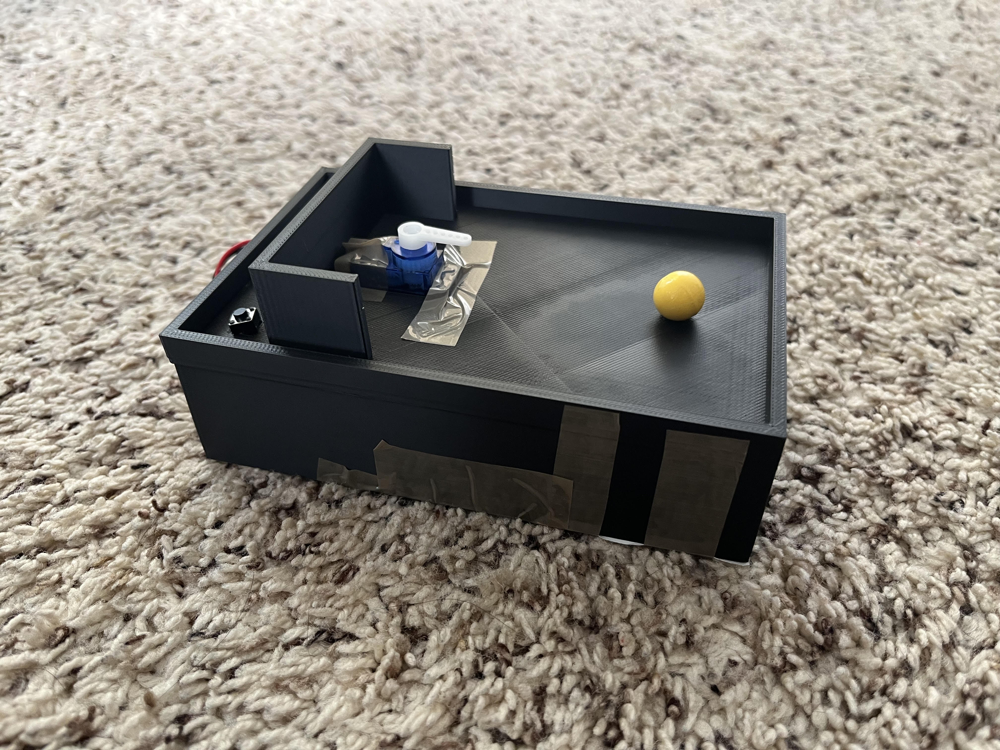

## ⚽ Servo Soccer

This Arduino project is based off penalty kicks (and shootouts) in soccer! It can be played with 2 players with  one as the goalie and the other as the penalty taker. However, beware which side you pick to defend as the  goalkeeper as your servo goalie won't be able to change direction after until the reset button is pressed!

<i>A picture of the game</i>

## 🪛 Materials
Here is a list of parts I used to create this project:
- Arduino Uno
- Mini Breadboard
- Jumper Wires (M-M & M-F)
- Hookup Wires
- Resistors
- 2 Pin Buttons
- Servo + Servo Attachment
- Battery + Battery Clip
- Marble (or other tiny ball)

## 🧊 CAD
Here is the [link](https://cad.onshape.com/documents/42b7f5b0e6fb255c9f2d6b39/w/c99ec2d29c27575f3afbe994/e/dfa8bfe5e1ae3cb910fdb250?renderMode=0&uiState=677dbc97000d703ebf0f04ea&authuser=0) to the CAD model!

## 💻 Code
Here is a brief overview of the code for this project!
- Lines 1-12: Initializing buttons, servo, and variables.
- Lines 13-20: Servo pin attachment and input pin type declaration.
- Lines 21-46: Main game loop
  -  Lines 22-24: Button states set with DigitalRead.
  -  Lines 25-43: Buttons states checked and game follows accordingly.
